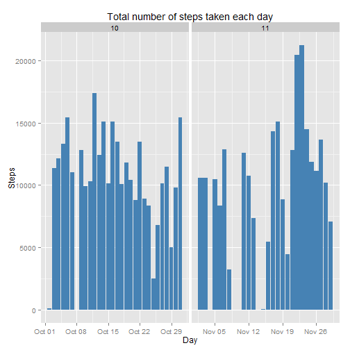
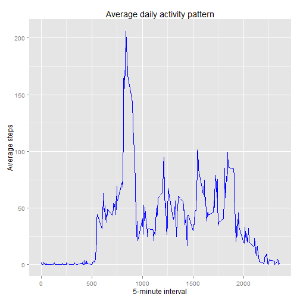
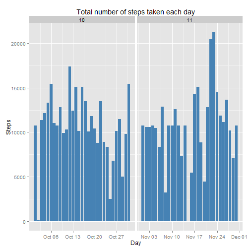
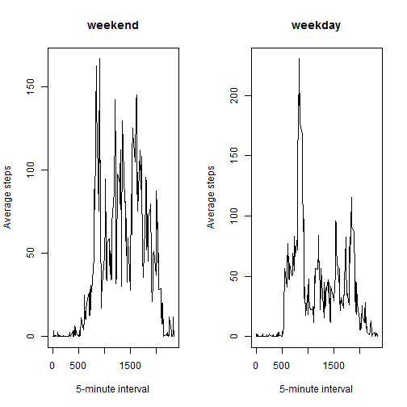

What is mean total number of steps taken per day?
=================================================

Make a histogram of the total number of steps taken each day

```r
dat <- read.csv("activity.csv")
head(dat,5)
```

```
##   steps       date interval
## 1    NA 2012-10-01        0
## 2    NA 2012-10-01        5
## 3    NA 2012-10-01       10
## 4    NA 2012-10-01       15
## 5    NA 2012-10-01       20
```

```r
dat$date <- as.Date(dat$date, format = "%Y-%m-%d")
dat$month <- as.numeric(format(dat$date, "%m"))

library(ggplot2)
g <- ggplot(dat, aes(date, steps))
g + geom_bar(stat="identity", fill="steelblue")+labs(title="Total number of steps taken each day", x="Day", y="Steps")+facet_grid(.~month, scales="free")
```

```
## Warning: Removed 576 rows containing missing values (position_stack).
```

```
## Warning: Removed 1728 rows containing missing values (position_stack).
```

 

Calculate and report the mean and median total number of steps taken per day

```r
dat <- read.csv("activity.csv")
dat$date <- as.Date(dat$date, format = "%Y-%m-%d")
t0 <- aggregate(dat$steps, list(dat$date), FUN = "sum")
mean(t0$x, na.rm=T)
```

```
## [1] 10766.19
```

```r
median(t0$x, na.rm=T)
```

```
## [1] 10765
```

What is the average daily activity pattern?
===========================================

Make a time series plot (i.e. type = "l") of the 5-minute interval (x-axis) and the average number of steps taken, averaged across all days (y-axis)

```r
library(ggplot2)
dat <- read.csv("activity.csv")
dat$date <- as.Date(dat$date, format = "%Y-%m-%d")
cleandat <- na.omit(dat)
i0 <- aggregate(cleandat$steps, list(as.numeric(as.character(cleandat$interval))), FUN = "mean")
g <- ggplot(i0, aes(Group.1, x))
g + geom_line(color="blue") + labs(title="Average daily activity pattern", x="5-minute interval", y="Average steps")
```

 

Which 5-minute interval, on average across all the days in the dataset, contains the maximum number of steps?

```r
dat <- read.csv("activity.csv")
dat$date <- as.Date(dat$date, format = "%Y-%m-%d")
cleandat <- na.omit(dat)
i0 <- aggregate(cleandat$steps, list(as.numeric(as.character(cleandat$interval))), FUN = "mean")
i0[which.max(i0$x),]
```

```
##     Group.1        x
## 104     835 206.1698
```

Imputing missing values
=======================

Calculate and report the total number of missing values in the dataset (i.e. the total number of rows with NAs)

```r
dat <- read.csv("activity.csv")
dat$date <- as.Date(dat$date, format = "%Y-%m-%d")
sapply(dat, function(x) sum(length(which(is.na(dat)))))
```

```
##    steps     date interval 
##     2304     2304     2304
```

Devise a strategy for filling in all of the missing values in the dataset. The strategy does not need to be sophisticated. For example, you could use the mean/median for that day, or the mean for that 5-minute interval, etc.

Fill in missing values with mean for the corresponding 5-minute intervals

```r
dat <- read.csv("activity.csv")
dat$date <- as.Date(dat$date, format = "%Y-%m-%d")
cleandat <- na.omit(dat)
mv0 <- is.na(dat$steps)
mn0 <- tapply(cleandat$steps, cleandat$interval, mean)
dat$steps[mv0] <- mn0[as.character(cleandat$interval[mv0])] 
```

Create a new dataset that is equal to the original dataset but with the missing data filled in.

```r
dat <- read.csv("activity.csv")
dat$date <- as.Date(dat$date, format = "%Y-%m-%d")
newdat <- dat
mv0 <- is.na(newdat$steps)
cleandat <- na.omit(dat)
mn0 <- tapply(cleandat$steps, cleandat$interval, mean)
newdat$steps[mv0] <- mn0[as.character(newdat$interval[mv0])]
```

Make a histogram of the total number of steps taken each day 

```r
dat <- read.csv("activity.csv")
dat$date <- as.Date(dat$date, format = "%Y-%m-%d")
newdat <- dat
mv0 <- is.na(newdat$steps)
cleandat <- na.omit(dat)
mn0 <- tapply(cleandat$steps, cleandat$interval, mean)
newdat$steps[mv0] <- mn0[as.character(newdat$interval[mv0])]
newdat$day <- (format(newdat$date, "%m%d"))
daysteps <- aggregate(newdat$steps, list(newdat$day), FUN="sum")
daysteps$Group.1 <- as.Date(daysteps$Group.1, "%m%d")
daysteps$month <- format(daysteps$Group.1, "%m")
library(ggplot2)
g <- ggplot(daysteps, aes(Group.1, x))
g + geom_bar(stat="identity", fill="steelblue") + labs(x="Day", y="Steps", title="Total number of steps taken each day")+facet_grid(.~month, scales="free")
```

 

Calculate and report the mean and median total number of steps taken per day

```r
newdatmean <- mean(daysteps$x)
newdatmean
```

```
## [1] 10766.19
```

```r
newdatmedian <- median(daysteps$x)
newdatmedian
```

```
## [1] 10766.19
```

Do these values differ from the estimates from the first part of the assignment?

```r
meanbef <- mean(t0$x, na.rm=T)
medianbef <- median(t0$x, na.rm=T)
newdatmean - meanbef
```

```
## [1] 0
```

```r
newdatmedian - medianbef
```

```
## [1] 1.188679
```

What is the impact of imputing missing data on the estimates of the total daily number of steps?
The mean values of both datasets before and after imputting missing data remain the same while the median of the new dataset (with missing data input) is greater.

Are there differences in activity patterns between weekdays and weekends?
=========================================================================
Create a new factor variable in the dataset with two levels - "weekday" and "weekend" indicating whether a given date is a weekday or weekend day.

```r
dat <- read.csv("activity.csv")
dat$date <- as.Date(dat$date, format = "%Y-%m-%d")
newdat <- dat
mv0 <- is.na(newdat$steps)
cleandat <- na.omit(dat)
mn0 <- tapply(cleandat$steps, cleandat$interval, mean)
newdat$steps[mv0] <- mn0[as.character(newdat$interval[mv0])]
newdat$week <- weekdays (newdat$date, abbreviate=FALSE)
newdat$week <- as.factor(newdat$week)
newdat$week <- ifelse(newdat$week %in% c("Saturday", "Sunday"), "Weekend", "Weekday")
head(newdat)
```

```
##       steps       date interval    week
## 1 1.7169811 2012-10-01        0 Weekday
## 2 0.3396226 2012-10-01        5 Weekday
## 3 0.1320755 2012-10-01       10 Weekday
## 4 0.1509434 2012-10-01       15 Weekday
## 5 0.0754717 2012-10-01       20 Weekday
## 6 2.0943396 2012-10-01       25 Weekday
```

Make a panel plot containing a time series plot (i.e. type = "l") of the 5-minute interval (x-axis) and the average number of steps taken, averaged across all weekday days or weekend days (y-axis).

```r
dat <- read.csv("activity.csv")
dat$date <- as.Date(dat$date, format = "%Y-%m-%d")
newdat <- dat
mv0 <- is.na(newdat$steps)
cleandat <- na.omit(dat)
mn0 <- tapply(cleandat$steps, cleandat$interval, mean)
newdat$steps[mv0] <- mn0[as.character(newdat$interval[mv0])]
newdat$week <- weekdays (newdat$date, abbreviate=FALSE)
newdat$week <- as.factor(newdat$week)
newdat$week <- ifelse(newdat$week %in% c("Saturday", "Sunday"), "Weekend", "Weekday")
weekend <- subset(newdat, week == "Weekend", c("steps", "date", "interval"))
weekday <- subset(newdat, week == "Weekday", c("steps", "date", "interval"))
mw0 <- aggregate (weekend$steps, list(as.numeric(as.character(weekend$interval))), FUN="mean")
mw1 <- aggregate (weekday$steps, list(as.numeric(as.character(weekday$interval))), FUN="mean")
par(mfrow=c(1,2))
plot(mw0, type="l", xlab="5-minute interval", ylab="Average steps", main="weekend")
plot(mw1, type="l", xlab="5-minute interval", ylab="Average steps", main="weekday")
```

 


